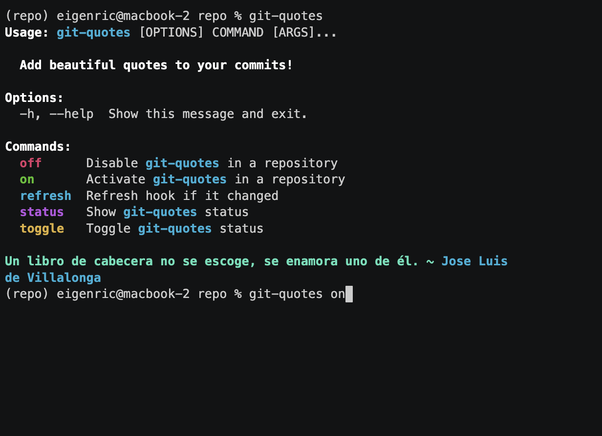

# Git Quotes

[](https://badge.fury.io/py/git-quotes)
[](https://pypi.python.org/pypi/git-quotes)
[](https://github.com/eigenric/git-quotes/actions/workflows/check.yml)

Add beautiful quotes to your commits!

(in Spanish)

## Installation

```console
$ pip install git-quotes --user
```

[](https://asciinema.org/a/iRZ3ZV29wLCzULkZEkw2NNj0Q)

## Features

- [x] Default global status (on/off)
- [x] Pip installable
- [x] Colorful cli thanks to crayons
- [ ] Support english quotes
- [ ] Set custom category or author for quotes.
